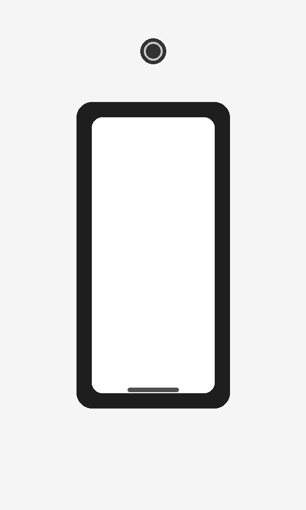

# SoundTag

NFC-triggered, multi-device audio playback server — play sounds on multiple phones with a single tag and no apps required.

[](https://github.com/soundtag1/soundtag/releases)
[](https://github.com/soundtag1/soundtag/releases)
[](https://github.com/soundtag1/soundtag/stargazers)

[](LICENSE)

**🌐 Website & install guide:** https://soundtag1.github.io/soundtag/



> The **downloads** badge counts downloads of files attached to [GitHub Releases](https://github.com/soundtag1/soundtag/releases). Cut a release (and attach an asset, e.g. a zip of the app) for it to climb.

## Overview

SoundTag lets you tap an NFC tag on one or more phones (iPhone and Android). Each phone opens a blank white listener page and, after a single tap to unlock audio, stays connected to a central audio stream. You control that stream from a simple web control panel where you can upload sounds, tap a file name to play it, or stop playback (which makes the stream go silent without disconnecting listeners).

## Features

- **No mobile apps needed** – uses browsers and standard NFC to open the listener page.
- **Works on multiple devices** – all connected phones hear the same audio at once.
- **Simple control panel** – upload audio files and tap their names to play them.
- **Stop = silence** – stop playback without disconnecting listeners.
- **Cross‑platform** – supports iPhone (iOS 13+), Android, Windows, macOS and Linux.
- **MIT licensed** – build on it freely.

## What SoundTag cannot do

- It cannot change system volume, bypass mute mode or play audio without a user tap (these are OS restrictions on iOS and Android).
- It does not run in the background once the listener page is closed.

## Quick install

You need Node.js and ffmpeg installed. The install scripts create a `soundtag` folder, install dependencies and start the server.

### macOS / Linux

```bash
curl -fsSL https://raw.githubusercontent.com/soundtag1/soundtag/main/install/install.sh | bash
```

### Windows (PowerShell)

RUN COMMANDS 1 BY 1!!!

```powershell
irm https://raw.githubusercontent.com/soundtag1/soundtag/main/install/install.ps1 -OutFile install.ps1
powershell -ExecutionPolicy Bypass -File .\install.ps1
```

Alternatively, download and double‑click `install/install.bat`.

## Authentication (control panel)

The control panel is protected by a local sign-in page. Listeners (`/listener`)
and the audio stream stay public so phones can join without a login.

Set your credentials with environment variables before starting the server:

```bash
export SOUNDTAG_USER=admin
export SOUNDTAG_PASS=your-secret-password
# optional: export SESSION_SECRET=a-long-random-string
```

If `SOUNDTAG_PASS` is not set, a random password is generated and printed to the
console on startup. Visiting `/control` redirects to `/login` until you sign in;
sessions last 12 hours and you can sign out from the panel.

## Using SoundTag

1. Install and run the server using the commands above.
2. Expose port 3000 on your network. For internet access you can port‑forward 3000 or use a tunnel service such as playit.gg.
3. Program your NFC tag (or a QR code) to open:

   ```
   https://your-public-url/listener
   ```

   This is the blank white listener page. Tapping once on this page unlocks audio.

4. Open the control panel at:

   ```
   https://your-public-url/control
   ```

   Sign in with your `SOUNDTAG_USER` / `SOUNDTAG_PASS` credentials, then upload one or more `.mp3`, `.wav`, `.ogg` or `.m4a` files. Each file appears as a tappable row.

5. Tap a file name in the control panel to broadcast it to all connected phones.
6. Press **Stop (Silent)** to make the audio stream go silent while keeping listeners connected.

## Contributing

Pull requests are welcome. For major changes, please open an issue first to discuss what you would like to change.

## License

This project is licensed under the MIT License – see the [LICENSE](LICENSE) file for details.

> Everything in this repository is AI‑generated. No code was written by humans.
